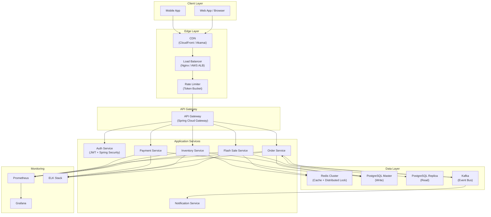
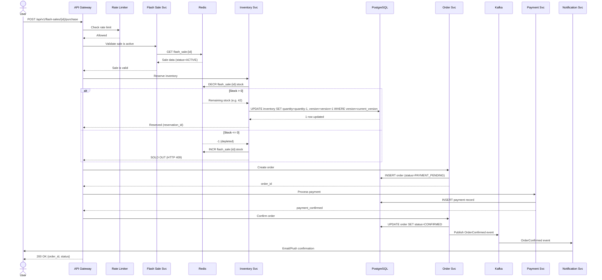
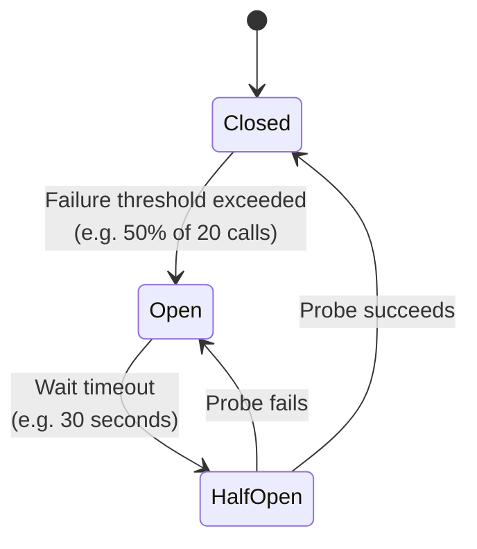
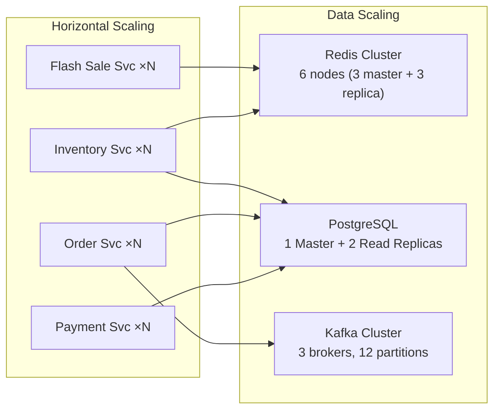

# Online Flash Sale — High Level Design (HLD)

## 1. Problem Statement

Design a system that handles **time-limited flash sales** where a limited quantity of products is offered at deep discounts for a short window (minutes to hours). The system must handle:

- **Massive traffic spikes** — 100K+ concurrent users hitting "Buy" at the exact same second
- **Inventory consistency** — No overselling; exactly N items sold, never N+1
- **Low latency** — Sub-second response for purchase attempts
- **Fairness** — First-come-first-served; no request should be silently dropped

---

## 2. Functional Requirements

| ID | Requirement |
|----|------------|
| FR-1 | Admin creates a flash sale (product, quantity, start/end time, discount) |
| FR-2 | Users browse upcoming and active flash sales |
| FR-3 | Users purchase items during an active sale (one per user) |
| FR-4 | System enforces inventory limits — no overselling |
| FR-5 | System processes payment and confirms order |
| FR-6 | Users receive order confirmation via email/push notification |
| FR-7 | Admin monitors sale metrics in real-time |

## 3. Non-Functional Requirements

| ID | Requirement | Target |
|----|------------|--------|
| NFR-1 | Availability | 99.99% during sale windows |
| NFR-2 | Latency (P99) | < 500ms for purchase API |
| NFR-3 | Throughput | 100K+ concurrent purchase requests |
| NFR-4 | Consistency | Strong consistency for inventory |
| NFR-5 | Durability | Zero lost orders after payment confirmation |
| NFR-6 | Scalability | Horizontal scaling for all stateless services |

---

## 4. Capacity Estimation

### Assumptions
- 10 million registered users
- 500K users attempt a single flash sale
- Sale window: 5 minutes
- Peak QPS: **500,000 / 300s ≈ 1,700 QPS** (sustained), **burst: ~50K QPS** in first 10 seconds

### Storage
| Entity | Size/Record | Records | Total |
|--------|------------|---------|-------|
| Users | 1 KB | 10M | 10 GB |
| Products | 2 KB | 100K | 200 MB |
| Flash Sales | 500 B | 10K | 5 MB |
| Orders | 1 KB | 5M/year | 5 GB/year |
| Inventory Logs | 200 B | 50M/year | 10 GB/year |

### Bandwidth
- **Incoming**: 50K req/s × 1 KB avg = **50 MB/s peak**
- **Outgoing**: 50K resp/s × 500 B avg = **25 MB/s peak**

### Cache
- Hot flash sale data: **< 100 MB** in Redis
- Rate limiter counters: **~500 MB** at peak

---

## 5. High Level Architecture



---

## 6. Component Descriptions

### 6.1 Edge Layer

| Component | Role |
|-----------|------|
| **CDN** | Caches static sale pages, product images. Absorbs 80%+ of read traffic. |
| **Load Balancer** | L7 load balancing with health checks, sticky sessions off for stateless services. |
| **Rate Limiter** | Token bucket per user (5 req/s for purchase endpoint). Prevents bot abuse. |

### 6.2 API Gateway (Spring Cloud Gateway)
- Route requests to microservices
- JWT validation (stateless auth)
- Request/response transformation
- Circuit breaker (Resilience4j)
- Request logging & correlation ID injection

### 6.3 Auth Service
- User registration & login
- JWT token issuance (access + refresh tokens)
- Spring Security integration
- OAuth2 support for social login

### 6.4 Flash Sale Service
- CRUD operations for flash sales
- Pre-loads sale data into Redis before sale starts (warm-up)
- Returns sale status (upcoming / active / ended)
- **Reads from Redis first, PostgreSQL replica as fallback**

### 6.5 Inventory Service ⭐ (Most Critical)
- Maintains real-time stock count in **Redis** (atomic `DECR`)
- Validates against PostgreSQL for final consistency
- Implements all three concurrency control strategies:
  - **Distributed Mutex** (Redis Redlock)
  - **Optimistic Locking** (version column)
  - **Pessimistic Locking** (SELECT FOR UPDATE)
- Publishes inventory change events to Kafka

### 6.6 Order Service
- Creates orders after successful inventory reservation
- Manages order state machine: `CREATED → PAYMENT_PENDING → PAID → CONFIRMED → SHIPPED`
- Consumes Kafka events for async order confirmation
- Implements idempotency via unique order tokens

### 6.7 Payment Service
- Integrates with payment gateways (Stripe/Razorpay)
- Handles payment callbacks and webhooks
- Refund processing for failed orders
- Idempotent payment processing

### 6.8 Notification Service
- Consumes Kafka events (order confirmed, sale starting)
- Sends email, SMS, push notifications
- Template-based notification system

---

## 7. Data Flow — Flash Sale Purchase



---

## 8. Caching Strategy

### Multi-Layer Cache Architecture

```
┌─────────────────┐     ┌──────────────┐     ┌──────────────┐
│  Browser Cache   │────▶│   CDN Cache   │────▶│  Redis Cache  │────▶ PostgreSQL
│  (Static assets) │     │ (Sale pages)  │     │ (Hot data)    │
└─────────────────┘     └──────────────┘     └──────────────┘
```

| Data | Cache Location | TTL | Invalidation |
|------|---------------|-----|-------------|
| Sale listing page | CDN | 30s | On sale status change |
| Product details | CDN + Redis | 5 min | On product update |
| Inventory count | Redis only | Real-time | Atomic DECR/INCR |
| User session/JWT | Client-side | 15 min | On logout/revoke |
| Rate limit counters | Redis | Sliding window | Auto-expire |

### Cache Warm-Up (Pre-Sale)
Before a flash sale begins, a **scheduled job** pre-loads:
1. Flash sale metadata → Redis
2. Inventory count → Redis (`SET flash_sale:{id}:stock {quantity}`)
3. Product details → Redis
4. Static sale page → CDN

---

## 9. Failure Handling

### Circuit Breaker Pattern (Resilience4j)



### Failure Scenarios & Mitigations

| Scenario | Impact | Mitigation |
|----------|--------|-----------|
| Redis down | Cannot check inventory | Fallback to DB pessimistic lock; circuit breaker trips |
| DB master down | Cannot persist orders | Queue orders in Kafka; retry when DB recovers |
| Payment gateway timeout | Order stuck in PENDING | Background job retries with exponential backoff; auto-cancel after 10 min |
| Kafka down | Notifications delayed | Local retry buffer; guaranteed delivery on recovery |
| Inventory mismatch (Redis ≠ DB) | Potential oversell | Periodic reconciliation job; DB is source of truth |

### Idempotency
- Every purchase request includes an **idempotency key** (UUID generated client-side)
- Server stores key → result mapping in Redis (TTL: 24h)
- Duplicate requests return the cached result without re-processing

---

## 10. Scalability Design



| Component | Scaling Strategy |
|-----------|-----------------|
| API Gateway | Horizontal (K8s HPA based on CPU/RPS) |
| Flash Sale Service | Horizontal + cached reads (mostly read-heavy) |
| Inventory Service | Horizontal + Redis atomic ops (bottleneck is Redis, not app) |
| Order Service | Horizontal + DB connection pool |
| PostgreSQL | Vertical (master) + Horizontal (read replicas) |
| Redis | Cluster mode (hash slots) + read replicas |
| Kafka | Partition-based parallelism |

---

## 11. Technology Stack Summary

| Layer | Technology |
|-------|-----------|
| Language | Java 17+ |
| Framework | Spring Boot 3.x + Spring Cloud |
| API Gateway | Spring Cloud Gateway |
| Auth | Spring Security + JWT |
| Database | PostgreSQL 15 |
| Cache | Redis 7 (Cluster Mode) |
| Message Queue | Apache Kafka |
| Circuit Breaker | Resilience4j |
| Containerization | Docker + Kubernetes |
| Monitoring | Prometheus + Grafana |
| Logging | ELK Stack (Elasticsearch, Logstash, Kibana) |
| CI/CD | GitHub Actions |
