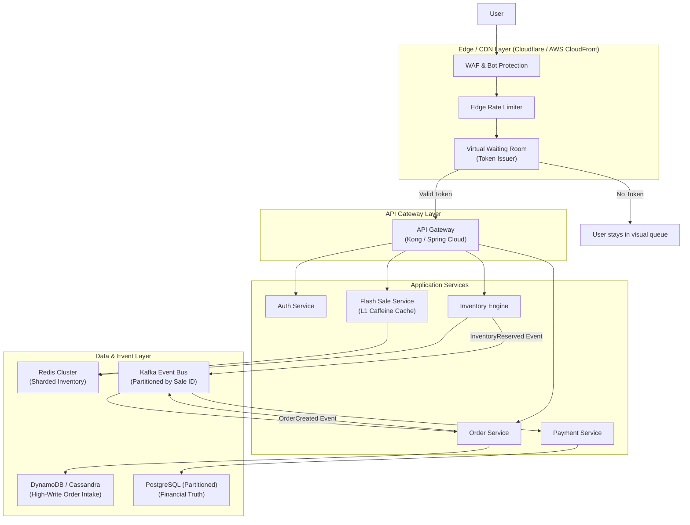
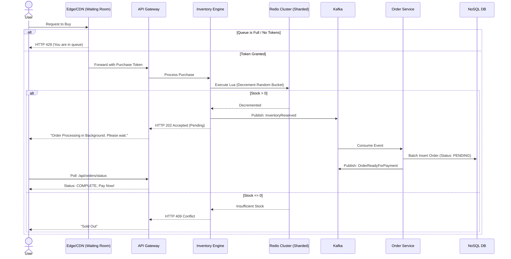

# Online Flash Sale — High Level Design (Enterprise Scale)

## 1. Problem Statement

Design a robust, globally scalable system that handles extreme **time-limited flash sales** (e.g., Prime Day, Big Billion Days) where limited quantities of products are heavily discounted. The system must operate seamlessly under extreme concurrency.

- **Extreme Traffic Spikes** — 100M+ users attempting to buy 10,000 items in a few seconds.
- **Inventory Consistency** — Zero overselling under any circumstance.
- **Fairness & Queueing** — Prevent API abuse, block bots, and enforce strict First-Come-First-Served policies.
- **Zero Downtime** — Database connection exhaustion or hot-key limits must not crash the broader ecosystem.

---

## 2. Advanced High-Level Architecture (Amazon/Flipkart Model)

Unlike traditional 3-tier architectures, a system at this scale relies heavily on Edge computing, Event-driven flows, and Data sharding.

---

## 3. Core Enterprise Patterns

### 3.1 Edge Compute & Virtual Waiting Room
If 100 million people request to buy 10,000 phones, letting 100 million requests reach the Inventory Service will melt the network, load balancers, and Redis. 
**Solution**: 
- Edge Workers intercept the `POST /purchase`.
- The Virtual Waiting Room grants exactly `Total Inventory × 3` valid **Purchase Tokens** cryptographically signed (JWTs).
- All millions of other requests are immediately returned a `429 Too Many Requests` or placed in a visual waiting queue right at the CDN edge.
- The internal API Gateway simply drops any request lacking a valid token.

### 3.2 Redis Hot-Key Sharding
A single item in Redis (`flash_sale:product_1:stock = 10000`) is located on a **single hash slot**, bound to a **single CPU thread**. At maximum, Redis handles ~100k operations per second on a single key.
**Solution**: 
- We break the inventory into buckets: `stock:1:bucket:1` .. `stock:1:bucket:10`.
- Each bucket holds 10% of the inventory.
- These buckets land on completely different Redis nodes in the cluster.
- The Inventory Engine randomly hashes incoming requests to a bucket. If one bucket is empty, it retries on another until the sale is over. Capacity is multiplied by 10x.

### 3.3 L1 Local Caching (Caffeine / Guava)
Checking if a sale is active from Redis for every request still adds unnecessary network latency.
**Solution**:
- Flash Sale services maintain a local RAM cache (`Caffeine`) of sale metadata.
- Cache TTL is 1–5 seconds. This guarantees sub-millisecond lookups. 

### 3.4 100% Async Order Pipeline (Event Sourcing)
Writing to SQL directly during peak traffic exhausts connection pools instantly.
**Solution**:
- Inventory Service executes a **Lua Script** on Redis. 
- If successful, it drops an `InventoryReserved` event into Kafka. **The HTTP request ends here and tells the user "Processing..."**.
- The Order Service pulls from Kafka, batches the orders (e.g., 500 at a time), and inserts them into an infinitely scalable NoSQL table (DynamoDB or Cassandra) or a highly partitioned PostgreSQL table.

---

## 4. Purchase Data Flow (Async Pattern)

---

## 5. Capacity & Scalability Adjustments

| Component | Architecture Shift for Extreme Scale |
|-----------|--------------------------------------|
| **Database** | Transitioned from Single Master to DynamoDB or Cassandra for writes, using PostgreSQL solely for the post-payment financial ledger. |
| **Inventory** | Lua scripts over multiple Redlock instances replace basic locking. Redis shards handle the state purely in RAM. |
| **Connection Pooling** | Handled natively by Kafka. The Order Service acts as a backpressure mechanism, pulling data exactly as fast as the DB can write it. |
| **Bot Mitigation** | Integrated tightly at the proxy edge via WAF algorithms and behavioral tracking before entering the data center. |
| **Auto-scaling** | Predictive scaling hooks trigger instances prior to sale launch. During the sale, Kubernetes HPA prevents degradation. |

---

## 6. Circuit Breaking & Fallbacks

For enterprise safety, Fallbacks are paramount:
- **Redis Node Dies**: Redis Sentinel/Cluster handles failover automatically. The Virtual Waiting Room pauses dispensing tokens for 5 seconds to allow election.
- **Kafka Lags**: If Kafka consumer lag spikes due to DB slowdown, the Database isn't overwhelmed. The pipeline simply slows down order generation. Users wait longer on the "Processing" UI screen.
- **Payment Gateway Fails**: Orders remain in `PAYMENT_PENDING` with a TTL of 15 minutes. Automatically restocked via Kafka `PaymentFailed` event if unmet.
