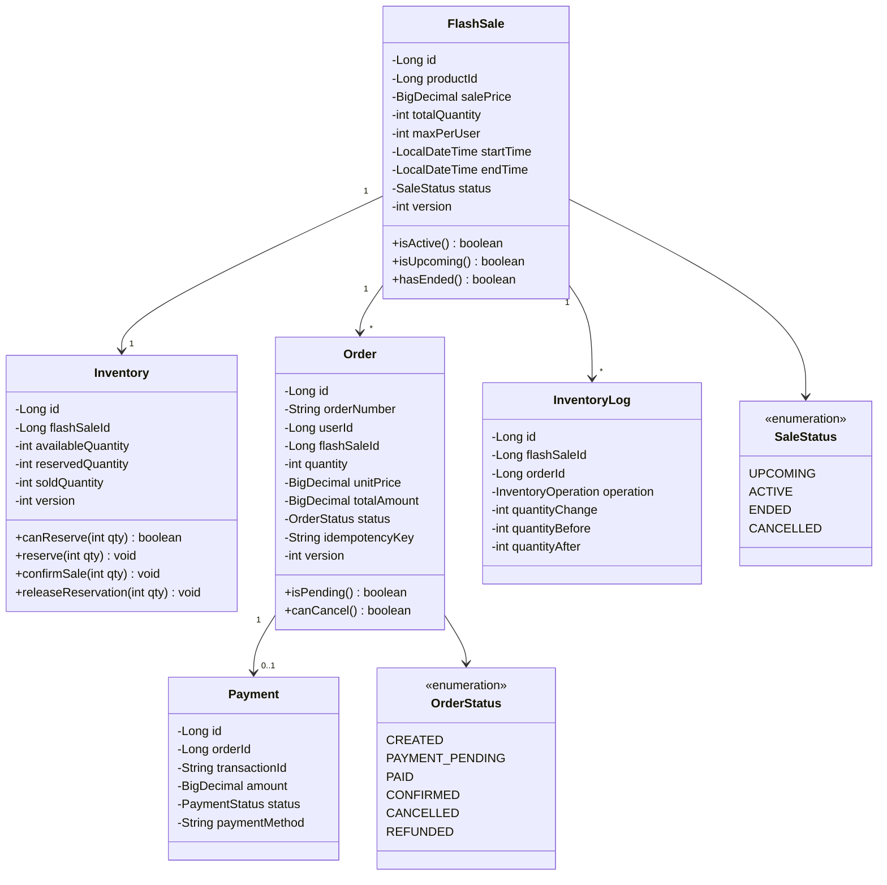
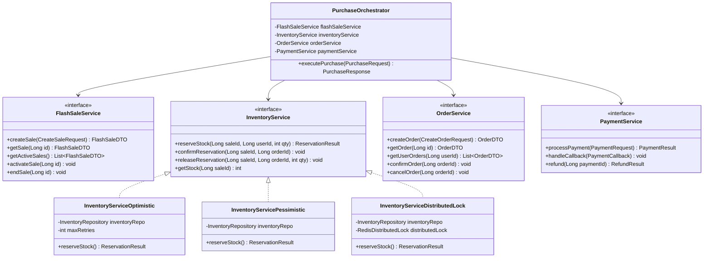
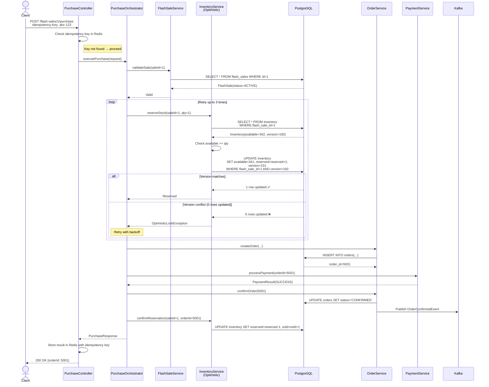
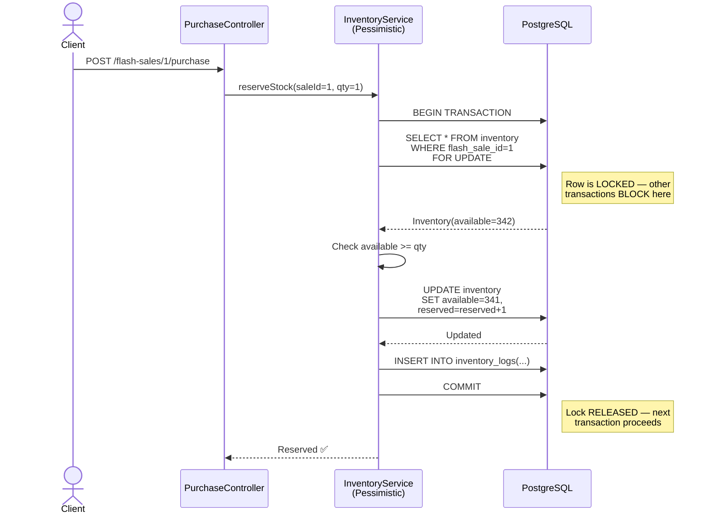
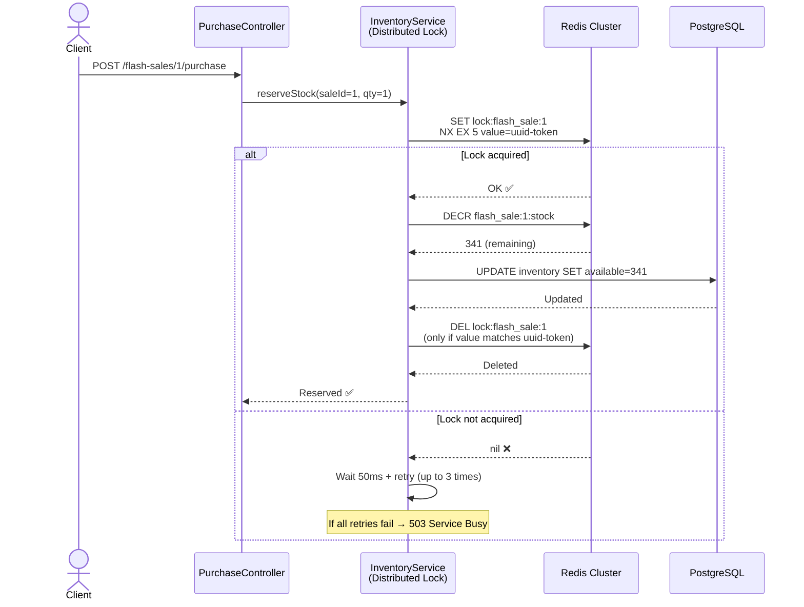
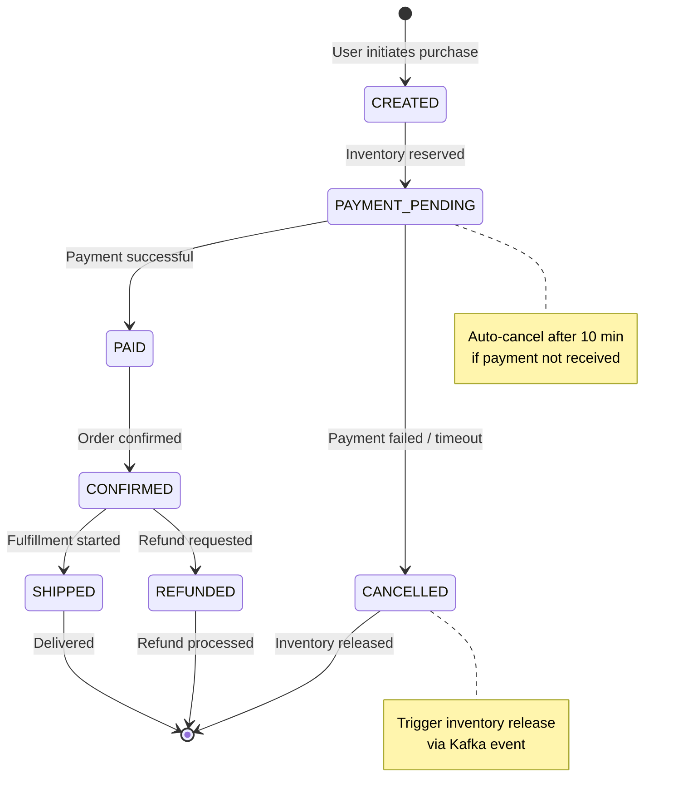

# Online Flash Sale — Low Level Design (LLD)

## 1. Database Schema Design

### ER Diagram

```mermaid
erDiagram
    USERS {
        bigint id PK
        varchar username UK
        varchar email UK
        varchar password_hash
        varchar phone
        enum role "ADMIN, CUSTOMER"
        timestamp created_at
        timestamp updated_at
    }

    PRODUCTS {
        bigint id PK
        varchar name
        text description
        decimal original_price
        varchar image_url
        varchar category
        boolean is_active
        timestamp created_at
        timestamp updated_at
    }

    FLASH_SALES {
        bigint id PK
        bigint product_id FK
        decimal sale_price
        integer total_quantity
        integer max_per_user
        timestamp start_time
        timestamp end_time
        enum status "UPCOMING, ACTIVE, ENDED, CANCELLED"
        integer version "optimistic lock"
        timestamp created_at
        timestamp updated_at
    }

    INVENTORY {
        bigint id PK
        bigint flash_sale_id FK UK
        integer available_quantity
        integer reserved_quantity
        integer sold_quantity
        integer version "optimistic lock"
        timestamp updated_at
    }

    ORDERS {
        bigint id PK
        varchar order_number UK
        bigint user_id FK
        bigint flash_sale_id FK
        integer quantity
        decimal unit_price
        decimal total_amount
        enum status "CREATED, PAYMENT_PENDING, PAID, CONFIRMED, CANCELLED, REFUNDED"
        varchar idempotency_key UK
        integer version "optimistic lock"
        timestamp created_at
        timestamp updated_at
    }

    PAYMENTS {
        bigint id PK
        bigint order_id FK
        varchar transaction_id UK
        decimal amount
        enum status "PENDING, SUCCESS, FAILED, REFUNDED"
        varchar payment_method
        varchar gateway_response
        timestamp created_at
        timestamp updated_at
    }

    INVENTORY_LOGS {
        bigint id PK
        bigint flash_sale_id FK
        bigint order_id FK
        enum operation "RESERVE, CONFIRM, RELEASE, RECONCILE"
        integer quantity_change
        integer quantity_before
        integer quantity_after
        timestamp created_at
    }

    USERS ||--o{ ORDERS : places
    PRODUCTS ||--o{ FLASH_SALES : "sold in"
    FLASH_SALES ||--|| INVENTORY : has
    FLASH_SALES ||--o{ ORDERS : "purchased through"
    ORDERS ||--o| PAYMENTS : "paid via"
    FLASH_SALES ||--o{ INVENTORY_LOGS : tracks
    ORDERS ||--o{ INVENTORY_LOGS : references
```

---

## 2. DDL — SQL Table Definitions

```sql
-- =============================================
-- USERS TABLE
-- =============================================
CREATE TABLE users (
    id              BIGSERIAL PRIMARY KEY,
    username        VARCHAR(50)  NOT NULL UNIQUE,
    email           VARCHAR(100) NOT NULL UNIQUE,
    password_hash   VARCHAR(255) NOT NULL,
    phone           VARCHAR(20),
    role            VARCHAR(20)  NOT NULL DEFAULT 'CUSTOMER',
    created_at      TIMESTAMP    NOT NULL DEFAULT NOW(),
    updated_at      TIMESTAMP    NOT NULL DEFAULT NOW()
);
CREATE INDEX idx_users_email ON users(email);

-- =============================================
-- PRODUCTS TABLE
-- =============================================
CREATE TABLE products (
    id              BIGSERIAL PRIMARY KEY,
    name            VARCHAR(200) NOT NULL,
    description     TEXT,
    original_price  DECIMAL(12,2) NOT NULL,
    image_url       VARCHAR(500),
    category        VARCHAR(100),
    is_active       BOOLEAN NOT NULL DEFAULT TRUE,
    created_at      TIMESTAMP NOT NULL DEFAULT NOW(),
    updated_at      TIMESTAMP NOT NULL DEFAULT NOW()
);

-- =============================================
-- FLASH SALES TABLE
-- =============================================
CREATE TABLE flash_sales (
    id              BIGSERIAL PRIMARY KEY,
    product_id      BIGINT NOT NULL REFERENCES products(id),
    sale_price      DECIMAL(12,2) NOT NULL,
    total_quantity   INTEGER NOT NULL,
    max_per_user    INTEGER NOT NULL DEFAULT 1,
    start_time      TIMESTAMP NOT NULL,
    end_time        TIMESTAMP NOT NULL,
    status          VARCHAR(20) NOT NULL DEFAULT 'UPCOMING',
    version         INTEGER NOT NULL DEFAULT 0,
    created_at      TIMESTAMP NOT NULL DEFAULT NOW(),
    updated_at      TIMESTAMP NOT NULL DEFAULT NOW(),
    CONSTRAINT chk_sale_time CHECK (end_time > start_time),
    CONSTRAINT chk_sale_price CHECK (sale_price > 0),
    CONSTRAINT chk_total_qty CHECK (total_quantity > 0)
);
CREATE INDEX idx_flash_sales_status ON flash_sales(status);
CREATE INDEX idx_flash_sales_start ON flash_sales(start_time);

-- =============================================
-- INVENTORY TABLE (Hot path — most contested)
-- =============================================
CREATE TABLE inventory (
    id                  BIGSERIAL PRIMARY KEY,
    flash_sale_id       BIGINT NOT NULL UNIQUE REFERENCES flash_sales(id),
    available_quantity  INTEGER NOT NULL DEFAULT 0,
    reserved_quantity   INTEGER NOT NULL DEFAULT 0,
    sold_quantity       INTEGER NOT NULL DEFAULT 0,
    version             INTEGER NOT NULL DEFAULT 0,
    updated_at          TIMESTAMP NOT NULL DEFAULT NOW(),
    CONSTRAINT chk_available CHECK (available_quantity >= 0),
    CONSTRAINT chk_reserved CHECK (reserved_quantity >= 0)
);

-- =============================================
-- ORDERS TABLE
-- =============================================
CREATE TABLE orders (
    id              BIGSERIAL PRIMARY KEY,
    order_number    VARCHAR(50) NOT NULL UNIQUE,
    user_id         BIGINT NOT NULL REFERENCES users(id),
    flash_sale_id   BIGINT NOT NULL REFERENCES flash_sales(id),
    quantity        INTEGER NOT NULL DEFAULT 1,
    unit_price      DECIMAL(12,2) NOT NULL,
    total_amount    DECIMAL(12,2) NOT NULL,
    status          VARCHAR(30) NOT NULL DEFAULT 'CREATED',
    idempotency_key VARCHAR(100) NOT NULL UNIQUE,
    version         INTEGER NOT NULL DEFAULT 0,
    created_at      TIMESTAMP NOT NULL DEFAULT NOW(),
    updated_at      TIMESTAMP NOT NULL DEFAULT NOW(),
    CONSTRAINT uq_user_sale UNIQUE (user_id, flash_sale_id)
);
CREATE INDEX idx_orders_user ON orders(user_id);
CREATE INDEX idx_orders_sale ON orders(flash_sale_id);
CREATE INDEX idx_orders_status ON orders(status);

-- =============================================
-- PAYMENTS TABLE
-- =============================================
CREATE TABLE payments (
    id              BIGSERIAL PRIMARY KEY,
    order_id        BIGINT NOT NULL REFERENCES orders(id),
    transaction_id  VARCHAR(100) UNIQUE,
    amount          DECIMAL(12,2) NOT NULL,
    status          VARCHAR(20) NOT NULL DEFAULT 'PENDING',
    payment_method  VARCHAR(50),
    gateway_response TEXT,
    created_at      TIMESTAMP NOT NULL DEFAULT NOW(),
    updated_at      TIMESTAMP NOT NULL DEFAULT NOW()
);
CREATE INDEX idx_payments_order ON payments(order_id);

-- =============================================
-- INVENTORY AUDIT LOG
-- =============================================
CREATE TABLE inventory_logs (
    id              BIGSERIAL PRIMARY KEY,
    flash_sale_id   BIGINT NOT NULL REFERENCES flash_sales(id),
    order_id        BIGINT REFERENCES orders(id),
    operation       VARCHAR(20) NOT NULL,
    quantity_change  INTEGER NOT NULL,
    quantity_before  INTEGER NOT NULL,
    quantity_after   INTEGER NOT NULL,
    created_at      TIMESTAMP NOT NULL DEFAULT NOW()
);
CREATE INDEX idx_inv_log_sale ON inventory_logs(flash_sale_id);
```

---

## 3. Class Diagrams

### 3.1 Core Domain Model



### 3.2 Service Layer Architecture



---

## 4. API Specifications

### 4.1 Flash Sale APIs

---

#### `POST /api/v1/flash-sales`  — Create Flash Sale (Admin)

**Headers:**
```
Authorization: Bearer <admin_jwt_token>
Content-Type: application/json
X-Request-Id: <uuid>
```

**Request Body:**
```json
{
    "productId": 1001,
    "salePrice": 99.99,
    "totalQuantity": 500,
    "maxPerUser": 1,
    "startTime": "2026-04-15T10:00:00Z",
    "endTime": "2026-04-15T10:30:00Z"
}
```

**Response — 201 Created:**
```json
{
    "id": 1,
    "productId": 1001,
    "salePrice": 99.99,
    "totalQuantity": 500,
    "maxPerUser": 1,
    "startTime": "2026-04-15T10:00:00Z",
    "endTime": "2026-04-15T10:30:00Z",
    "status": "UPCOMING",
    "createdAt": "2026-04-14T06:35:00Z"
}
```

**Error Responses:**

| Code | Body | Condition |
|------|------|-----------|
| 400 | `{"error": "INVALID_TIME_RANGE", "message": "endTime must be after startTime"}` | Invalid input |
| 401 | `{"error": "UNAUTHORIZED"}` | Missing/invalid token |
| 403 | `{"error": "FORBIDDEN"}` | Non-admin user |
| 404 | `{"error": "PRODUCT_NOT_FOUND"}` | Product doesn't exist |

---

#### `GET /api/v1/flash-sales/{id}` — Get Sale Details

**Response — 200 OK:**
```json
{
    "id": 1,
    "product": {
        "id": 1001,
        "name": "iPhone 16 Pro",
        "originalPrice": 999.99,
        "imageUrl": "https://cdn.example.com/iphone16.jpg"
    },
    "salePrice": 99.99,
    "totalQuantity": 500,
    "availableQuantity": 342,
    "maxPerUser": 1,
    "startTime": "2026-04-15T10:00:00Z",
    "endTime": "2026-04-15T10:30:00Z",
    "status": "ACTIVE",
    "discount": "90%"
}
```

---

#### `GET /api/v1/flash-sales/active` — List Active Sales

**Query Parameters:** `page=0&size=20`

**Response — 200 OK:**
```json
{
    "content": [
        { "id": 1, "product": {...}, "salePrice": 99.99, "status": "ACTIVE", ... },
        { "id": 2, "product": {...}, "salePrice": 49.99, "status": "ACTIVE", ... }
    ],
    "page": 0,
    "size": 20,
    "totalElements": 2,
    "totalPages": 1
}
```

---

### 4.2 Purchase API (Critical Path)

#### `POST /api/v1/flash-sales/{id}/purchase` — Purchase Item

**Headers:**
```
Authorization: Bearer <user_jwt_token>
Content-Type: application/json
X-Idempotency-Key: <client-generated-uuid>
X-Request-Id: <uuid>
```

**Request Body:**
```json
{
    "quantity": 1,
    "paymentMethod": "CREDIT_CARD",
    "paymentToken": "tok_visa_4242"
}
```

**Response — 200 OK:**
```json
{
    "orderId": 5001,
    "orderNumber": "FS-20260415-5001",
    "flashSaleId": 1,
    "quantity": 1,
    "unitPrice": 99.99,
    "totalAmount": 99.99,
    "status": "CONFIRMED",
    "paymentId": 3001,
    "paymentStatus": "SUCCESS",
    "createdAt": "2026-04-15T10:00:05Z"
}
```

**Error Responses:**

| Code | Body | Condition |
|------|------|-----------|
| 400 | `{"error": "INVALID_QUANTITY"}` | qty < 1 or > maxPerUser |
| 404 | `{"error": "SALE_NOT_FOUND"}` | Sale ID invalid |
| 409 | `{"error": "SOLD_OUT", "message": "This flash sale is sold out"}` | No stock remaining |
| 409 | `{"error": "ALREADY_PURCHASED", "message": "You have already purchased from this sale"}` | Duplicate purchase |
| 409 | `{"error": "SALE_NOT_ACTIVE", "message": "Sale has not started or has ended"}` | Outside sale window |
| 422 | `{"error": "PAYMENT_FAILED", "message": "Payment declined"}` | Payment rejected |
| 429 | `{"error": "RATE_LIMITED", "retryAfter": 2}` | Too many requests |

---

### 4.3 Order APIs

#### `GET /api/v1/orders/{id}` — Get Order Details

**Response — 200 OK:**
```json
{
    "id": 5001,
    "orderNumber": "FS-20260415-5001",
    "flashSaleId": 1,
    "product": {
        "name": "iPhone 16 Pro",
        "imageUrl": "https://cdn.example.com/iphone16.jpg"
    },
    "quantity": 1,
    "unitPrice": 99.99,
    "totalAmount": 99.99,
    "status": "CONFIRMED",
    "payment": {
        "transactionId": "txn_abc123",
        "status": "SUCCESS",
        "method": "CREDIT_CARD"
    },
    "createdAt": "2026-04-15T10:00:05Z"
}
```

#### `GET /api/v1/users/me/orders` — Get My Orders

**Query Parameters:** `page=0&size=20&status=CONFIRMED`

---

### 4.4 Inventory API

#### `GET /api/v1/flash-sales/{id}/inventory` — Get Real-Time Stock

**Response — 200 OK:**
```json
{
    "flashSaleId": 1,
    "totalQuantity": 500,
    "availableQuantity": 342,
    "reservedQuantity": 8,
    "soldQuantity": 150,
    "lastUpdated": "2026-04-15T10:05:32Z"
}
```

---

## 5. Sequence Diagrams

### 5.1 Purchase Flow — Optimistic Locking



### 5.2 Purchase Flow — Pessimistic Locking



### 5.3 Purchase Flow — Distributed Lock (Redis Redlock)



---

## 6. Order State Machine



---

## 7. Rate Limiting Design

### Token Bucket Algorithm (Per User)

```
Configuration:
  - Bucket capacity: 5 tokens
  - Refill rate: 1 token/second
  - Applied to: POST /flash-sales/{id}/purchase

Redis Key: rate_limit:user:{userId}:purchase
Redis Value: { tokens: 5, last_refill: timestamp }
```

### Sliding Window Counter (Global)

```
Configuration:
  - Window: 1 second
  - Max requests: 10,000 per second (global)

Redis Key: rate_limit:global:purchase:{timestamp_second}
Redis Command: INCR + EXPIRE (1 second TTL)
```

---

## 8. Request Processing Pipeline

```mermaid
graph LR
    REQ["Incoming Request"] --> AUTH_FILTER["JWT Auth Filter"]
    AUTH_FILTER --> RATE_FILTER["Rate Limit Filter"]
    RATE_FILTER --> IDEMP_FILTER["Idempotency Filter"]
    IDEMP_FILTER --> VALID["Request Validation"]
    VALID --> CTRL["Controller"]
    CTRL --> SVC["Service Layer"]
    SVC --> REPO["Repository Layer"]
    REPO --> DB["Database"]

    style AUTH_FILTER fill:#e74c3c,color:#fff
    style RATE_FILTER fill:#f39c12,color:#fff
    style IDEMP_FILTER fill:#3498db,color:#fff
    style VALID fill:#2ecc71,color:#fff
```



**Filter Chain Order:**
1. **CORS Filter** — Allow cross-origin requests
2. **Request Logging Filter** — Log request ID, timestamp, path
3. **JWT Authentication Filter** — Validate token, extract user context
4. **Rate Limiting Filter** — Check token bucket, reject if exhausted
5. **Idempotency Filter** — Check if request already processed
6. **Request Validation** — Bean validation (`@Valid`)
