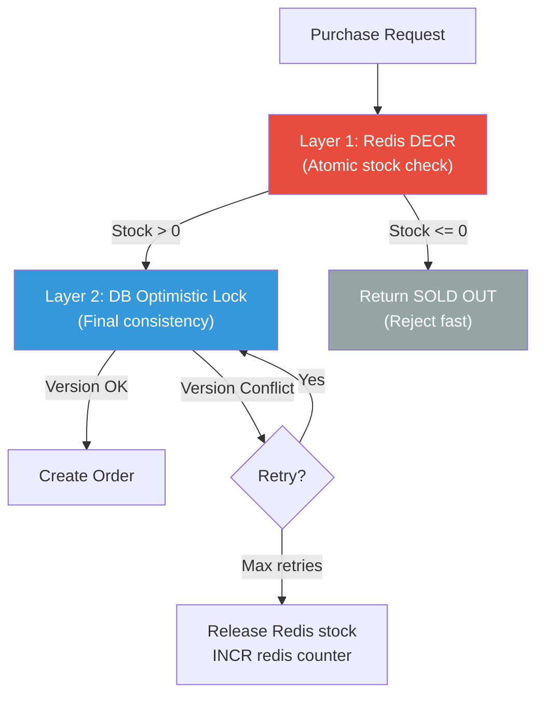

# Online Flash Sale — Concurrency Control Patterns

## Overview

In a flash sale, thousands of users try to purchase limited stock **simultaneously**. Without proper concurrency control, **race conditions** lead to **overselling**. This document covers three strategies with full Java/Spring Boot implementations.

---

## The Race Condition Problem

```
Thread A: reads stock = 1        Thread B: reads stock = 1
Thread A: stock > 0? YES         Thread B: stock > 0? YES
Thread A: stock = stock - 1 = 0  Thread B: stock = stock - 1 = 0
Thread A: SOLD ✅                Thread B: SOLD ✅  ← OVERSOLD!
```

**Both threads read the same value before either writes.** We need to serialize access to the inventory.

---

## 1. Distributed Mutex (Redis Redlock)

### Concept
A distributed lock ensures **only one thread across all server instances** can modify the inventory at a time. We use Redis `SET NX EX` (set-if-not-exists with expiry).

### How It Works

```
1. Acquire lock:    SET lock:flash_sale:{id} {uuid} NX EX 5
2. If acquired:     Read inventory → Validate → Update → Write
3. Release lock:    DEL lock:flash_sale:{id} (only if value == uuid)
4. If not acquired: Retry after 50ms (up to 3 times)
```

### Pros & Cons

| ✅ Pros | ❌ Cons |
|---------|---------|
| Simple mental model | Single point of contention (serialized) |
| Works across all app instances | Lower throughput due to serialization |
| Prevents all race conditions | Lock expiry can cause issues (GC pauses) |
| Good for small inventory counts | Redis becomes a bottleneck at extreme scale |

### When to Use
- **Low-to-medium contention** (< 1K concurrent users per sale)
- When you need **absolute safety** and throughput isn't critical
- When Redis is already part of your stack

---

## 2. Optimistic Locking (Version-Based)

### Concept
Instead of locking, we **allow concurrent reads** and detect conflicts at write time using a **version column**. If the version has changed since we read it, the UPDATE affects 0 rows, and we **retry**.

### How It Works

```sql
-- Step 1: READ with version
SELECT available_quantity, version FROM inventory WHERE flash_sale_id = ?;
-- Returns: available_quantity=342, version=150

-- Step 2: UPDATE with version check
UPDATE inventory
SET available_quantity = available_quantity - 1,
    reserved_quantity = reserved_quantity + 1,
    version = version + 1
WHERE flash_sale_id = ? AND version = 150;

-- If 1 row updated → SUCCESS
-- If 0 rows updated → CONFLICT → RETRY
```

### Pros & Cons

| ✅ Pros | ❌ Cons |
|---------|---------|
| High throughput (no lock held) | Retry storms under heavy contention |
| No deadlocks possible | Wasted work on failed attempts |
| Database-native (no external deps) | Not suitable for very long transactions |
| Built-in JPA `@Version` support | Starvation possible for unlucky threads |

### When to Use
- **Medium contention** with mostly successful writes
- When read-heavy workloads dominate
- When you want database-only solution (no Redis dependency)
- Flash sales with **hundreds** of concurrent buyers (not millions)

---

## 3. Pessimistic Locking (SELECT FOR UPDATE)

### Concept
We **lock the row in the database** before reading it. Other transactions that try to read the same row **block until the lock is released** (on COMMIT or ROLLBACK).

### How It Works

```sql
-- Step 1: BEGIN TRANSACTION

-- Step 2: Lock the row
SELECT * FROM inventory WHERE flash_sale_id = ? FOR UPDATE;
-- Other transactions BLOCK here until this one commits

-- Step 3: Check and update
UPDATE inventory
SET available_quantity = available_quantity - 1,
    reserved_quantity = reserved_quantity + 1
WHERE flash_sale_id = ?;

-- Step 4: COMMIT (releases the lock)
```

### Pros & Cons

| ✅ Pros | ❌ Cons |
|---------|---------|
| Guaranteed consistency | Serialized access = lower throughput |
| No retry logic needed | Potential for deadlocks |
| Simple to reason about | Holds DB connections longer |
| Database handles everything | Connection pool exhaustion risk |

### When to Use
- **High contention** on the same row
- When you **cannot tolerate retries** (predictable latency)
- Short transactions only (< 100ms)
- When stock is very limited (< 100 items) and contention is guaranteed

---

## 4. Comparison Matrix

| Criteria | Distributed Mutex | Optimistic Lock | Pessimistic Lock |
|----------|-------------------|-----------------|------------------|
| **Throughput** | Low (serialized) | High (parallel reads) | Medium (serialized writes) |
| **Latency** | Medium (lock acquire) | Low (if no conflicts) | Medium (wait for lock) |
| **Contention Handling** | Queue at Redis | Retry at app layer | Queue at DB |
| **Deadlock Risk** | None (single lock) | None | Possible |
| **External Dependency** | Redis required | None | None |
| **Implementation** | Moderate | Simple (JPA @Version) | Simple |
| **Best For** | Cross-service sync | Read-heavy, low conflict | High conflict, short txn |
| **Scalability** | Limited by Redis | Very good | Limited by DB connections |

---

## 5. Recommended Hybrid Strategy for Flash Sales

For production flash sales, use a **layered approach**:



**Layer 1 — Redis Atomic DECR**: Instantly rejects requests when stock is depleted. This handles 90%+ of traffic without touching the database.

**Layer 2 — DB Optimistic Lock**: For the requests that pass Redis, we use optimistic locking for the final write. This catches any Redis-DB inconsistencies and provides the source of truth.

**Why this works**:
- Redis DECR is O(1) and handles 100K+ ops/sec per node
- Only ~500 requests (=stock quantity) ever reach the database
- Optimistic locking handles the remaining contention elegantly
- If Redis fails, fall back to pessimistic locking on the database

---

## 6. Race Condition Analysis

### Scenario 1: Double Purchase (Same User)
```
Mitigation: UNIQUE constraint on (user_id, flash_sale_id) in orders table
Result: Second INSERT fails with constraint violation → caught and returned as 409
```

### Scenario 2: Inventory Goes Negative
```
Mitigation: CHECK constraint (available_quantity >= 0) in database
Result: Even if app logic has a bug, DB rejects negative values
```

### Scenario 3: Payment Fails After Inventory Reserved
```
Mitigation: Saga pattern — on payment failure:
  1. Cancel order (status → CANCELLED)
  2. Release inventory (available += reserved qty)
  3. INCR Redis counter to make stock available again
```

### Scenario 4: Server Crashes Mid-Transaction
```
Mitigation: Database transaction guarantees ACID
  - If crash before COMMIT → auto-rollback, no state change
  - Redis lock has TTL → auto-expires after 5 seconds
  - Background reconciliation job syncs Redis with DB every 30 seconds
```
